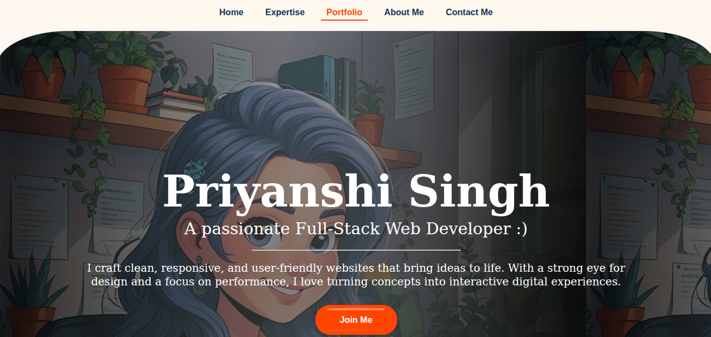

# My Portfolio

Welcome to my personal portfolio! This site showcases my skills, projects, and passion for building responsive, user-friendly websites and web applications. Each project reflects my learning journey and commitment to quality code.

## 📁 Features

- **Clean, modern, and responsive design**  
  Built with best practices for a seamless experience on all devices.
- **Highlighted featured projects**  
  Each project includes links to GitHub repositories and live demos.
- **About Me section**  
  Learn more about my journey, skills, and what drives me as a developer.
- **Contact form**  
  Get in touch with me directly through a simple, accessible contact form.
- **Scroll animations & interactive elements**  
  Enhanced with smooth animations and engaging UI components, including a stylish button from [uiverse.io](https://uiverse.io/).

## 🛠️ Tech Stack

- **HTML5**  
- **CSS3**  
- **JavaScript**  
- **Git & GitHub**

## 🚀 Getting Started

1. **Clone the repository:**
    ```bash
    git clone https://github.com/your-username/your-portfolio.git
    cd your-portfolio
    ```
2. **Open `index.html` in your browser**  
   (or deploy to your favorite static hosting service)

## 📸 Screenshots

<!-- Add a screenshot of your portfolio below -->


## 🤝 Contributing

Contributions, suggestions, and feedback are always welcome!  
Feel free to open an issue or submit a pull request.

## 📬 Contact

- Email: [priyanshisingh0222@gmail.com](mailto:priyanshisingh0222@gmail.com)
- [LinkedIn](https://www.linkedin.com/in/priyanshi-singh-27980a271/)
- [Twitter](https://x.com/Priyu42662521)

---

> Built with passion, curiosity, and continuous learning.
